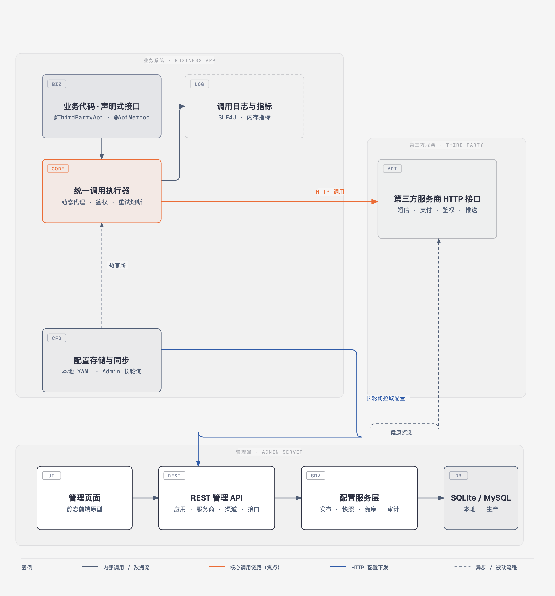

# Third API

面向 Java 企业应用的第三方接口动态注册与管理框架。它让短信、支付、鉴权、消息推送等第三方接口以“配置 + 声明式接口”的方式接入，支持配置热更新、统一鉴权、重试熔断、调用日志、健康监测和管理端发布。

## 核心能力

- 注解式声明第三方接口，替换业务代码里的硬编码 HTTP 调用
- 接口地址、密钥、超时、重试等配置可动态下发，无需重启服务
- 统一支持 API Key、Basic、OAuth2、签名四类鉴权
- 内置超时、重试、熔断，调用失败自动治理
- 统一调用日志与内存指标，便于线上排查
- 管理端包含应用、服务商、渠道、接口、鉴权、健康、审计、发布
- 本地联调默认使用 SQLite，生产环境可切换 MySQL

## 架构图

业务系统通过 `@ThirdPartyApi` 声明式接口与动态代理统一调用第三方 HTTP 接口；配置由管理端长轮询下发，发布后无需重启即可热更新：



- 可缩放矢量源文件：[docs/architecture.html](docs/architecture.html)

## 项目结构

| 模块 | 说明 |
|---|---|
| `third-api-sdk-core` | 对外注解与公共模型 |
| `third-api-spring-boot-starter` | 业务系统接入的 Spring Boot Starter |
| `third-api-admin-server` | 管理端后端 + 管理页面 |
| `third-api-admin-ui/prototype` | 管理端页面原型 |
| `docs/ddl/schema.sql` | MySQL 数据模型 |
| `docs/config-protocol.md` | 管理端配置下发协议 |
| `scripts/e2e-sqlite.sh` | SQLite 端到端联调脚本 |

## 快速开始

### 环境要求

- JDK 8+
- Maven 3.6+
- 浏览器（管理页面）
- MySQL 8（可选，仅生产环境需要）

### 1. 先跑通 SQLite 端到端

推荐先运行一键联调脚本，它会自动创建 SQLite 数据库、写入种子数据、启动管理端，并验证 Starter 从管理端拉取配置后调用真实 HTTP 接口：

```bash
bash scripts/e2e-sqlite.sh
```

看到 `BUILD SUCCESS` 即表示整条链路可用。

### 2. 启动管理端

```bash
mvn clean install
mvn -pl third-api-admin-server spring-boot:run
```

浏览器打开：

```text
http://localhost:8080
```

默认使用 SQLite 本地库，首次启动会自动建表和写入种子数据。

### 3. 使用 MySQL

```bash
mvn -pl third-api-admin-server spring-boot:run -Dspring-boot.run.profiles=mysql
```

先在 MySQL 执行根目录 `docs/ddl/schema.sql`，再调整 `application-mysql.yml` 中的连接信息。

## 接入现有 Spring Boot 项目

### 1. 安装到本地 Maven 仓库

```bash
mvn clean install
```

### 2. 引入依赖

```xml
<dependency>
    <groupId>com.thirdapi</groupId>
    <artifactId>third-api-spring-boot-starter</artifactId>
    <version>0.1.0-SNAPSHOT</version>
</dependency>
```

### 3. 开启 Starter

```java
@SpringBootApplication
@EnableThirdPartyApis
public class OrderApplication {
    public static void main(String[] args) {
        SpringApplication.run(OrderApplication.class, args);
    }
}
```

### 4. 声明第三方接口

用接口描述第三方 HTTP 契约：

```java
@ThirdPartyApi(provider = "sms", channel = "aliyun-sms")
public interface SmsClient {

    @ApiMethod(name = "send", path = "/v1/sms/send", method = HttpMethod.POST)
    ApiResult<String> send(SmsSendRequest request);

    @ApiMethod(name = "query", path = "/v1/sms/status/{bizId}", method = HttpMethod.GET)
    ApiResult<String> query(
            @ApiParam(name = "bizId", location = ParamLocation.PATH) String bizId,
            @ApiParam(name = "mobile", location = ParamLocation.QUERY) String mobile);
}
```

`@ApiParam` 支持 `PATH`、`QUERY`、`HEADER`、`BODY` 四种位置。未标注参数时，`POST/PUT/PATCH` 默认作为请求体，`GET` 默认作为查询参数。

### 5. 注入使用

```java
@Service
public class OrderService {

    private final SmsClient smsClient;

    public OrderService(ThirdApiClientFactory clientFactory) {
        this.smsClient = clientFactory.create(SmsClient.class);
    }

    public void sendOrderSms(SmsSendRequest request) {
        ApiResult<String> result = smsClient.send(request);
        // ...
    }
}
```

### 6. 本地模式配置

不依赖管理端时，用 YAML 描述接口地址和策略：

```yaml
third-api:
  mode: local
  app-name: order-service
  default-timeout:
    connect-ms: 3000
    read-ms: 5000
  default-retry:
    max-attempts: 2
    backoff-ms: 200
  endpoints:
    - provider: sms
      channel: aliyun-sms
      name: send
      base-url: https://dysmsapi.aliyuncs.com
      path: /v1/sms/send
      method: POST
      auth-type: OAUTH2
      token-url: https://example.com/oauth/token
      client-id: demo
      client-secret: demo-secret
```

### 7. 管理端模式配置

由管理端统一维护配置：

```yaml
third-api:
  mode: admin
  app-name: order-service
  admin-url: http://localhost:8080
  app-id: order-service
  app-secret: your-app-secret
  poll-interval-seconds: 30
  long-poll-timeout-seconds: 30
```

管理端发布新版本后，Starter 会在下一次轮询时拉取并热更新，无需重启业务服务。

## 配置项

| 配置 | 说明 | 默认值 |
|---|---|---|
| `third-api.enabled` | 是否启用 Starter | `true` |
| `third-api.mode` | 配置来源，`local` 或 `admin` | `local` |
| `third-api.admin-url` | 管理端地址 | 空 |
| `third-api.app-id` | 业务应用 ID | 空 |
| `third-api.app-secret` | 业务应用密钥 | 空 |
| `third-api.poll-interval-seconds` | 管理端轮询间隔 | `30` |
| `third-api.long-poll-timeout-seconds` | 长轮询等待时间 | `30` |
| `third-api.default-timeout.connect-ms` | 默认连接超时 | `3000` |
| `third-api.default-timeout.read-ms` | 默认读取超时 | `5000` |
| `third-api.default-retry.max-attempts` | 默认重试次数 | `2` |
| `third-api.default-retry.backoff-ms` | 默认重试间隔 | `200` |
| `third-api.endpoints[]` | 本地模式接口配置 | 空 |

## 管理端功能

- 应用管理：注册业务应用、绑定渠道
- 服务商管理：维护短信、支付、鉴权等服务商
- 渠道管理：维护 Base URL、环境、启用状态
- 接口管理：维护路径、HTTP 方法、超时、重试、熔断阈值
- 鉴权配置：按渠道维护 OAuth2、API Key、Basic、签名
- 健康监测：对启用接口执行 HTTP 探测
- 审计日志：记录配置变更与发布操作
- 配置发布：将当前配置发布为新版本并下发给业务服务

## 配置下发协议

管理端与 Starter 之间的接口约定见：

[docs/config-protocol.md](docs/config-protocol.md)

## 测试

普通构建与单元测试：

```bash
mvn clean install
```

SQLite 端到端测试：

```bash
bash scripts/e2e-sqlite.sh
```

## 自动构建与 Maven 仓库发布

GitHub Actions 工作流位于 [`.github/workflows/maven.yml`](.github/workflows/maven.yml)：

- 每次 push 到 `main` 或提交 PR 时，自动执行 `mvn clean verify` 构建并运行测试
- push 到 `main`、push `v*` 标签或手动触发工作流时，自动将 `third-api-sdk-core` 和 `third-api-spring-boot-starter` 发布到远端 Maven 仓库（父 POM 会一并发布）
- 默认使用 GitHub Packages，地址为 `https://maven.pkg.github.com/wangzaogen/third-api`，无需额外 Secret，工作流使用 `GITHUB_TOKEN` 认证

### 从 GitHub Packages 使用

先在 `~/.m2/settings.xml` 中配置凭据，个人访问令牌需要 `read:packages` 权限：

```xml
<settings>
  <servers>
    <server>
      <id>github</id>
      <username>你的 GitHub 用户名</username>
      <password>你的 personal access token</password>
    </server>
  </servers>
</settings>
```

再在业务项目 `pom.xml` 中加入仓库和依赖：

```xml
<repositories>
  <repository>
    <id>github</id>
    <url>https://maven.pkg.github.com/wangzaogen/third-api</url>
    <snapshots>
      <enabled>true</enabled>
    </snapshots>
  </repository>
</repositories>

<dependencies>
  <dependency>
    <groupId>com.thirdapi</groupId>
    <artifactId>third-api-spring-boot-starter</artifactId>
    <version>0.1.0-SNAPSHOT</version>
  </dependency>
</dependencies>
```

### 切换到 Nexus / 私服

在 GitHub 仓库的 `Settings -> Secrets and variables -> Actions` 中配置以下 Secret，工作流会自动生成 `settings.xml` 并使用：

| Secret | 说明 |
|---|---|
| `MAVEN_REPO_ID` | Maven server id，例如 `nexus-releases` |
| `MAVEN_REPO_URL` | 正式版本仓库地址 |
| `MAVEN_SNAPSHOT_URL` | 快照仓库地址，不填则使用 `MAVEN_REPO_URL` |
| `MAVEN_USERNAME` | 仓库用户名 |
| `MAVEN_PASSWORD` | 仓库密码或令牌 |

本地手动发布时执行：

```bash
mvn -Prelease clean deploy \
  -Dmaven.repo.id=nexus-releases \
  -Dmaven.repo.url=https://your-nexus/repository/maven-releases/ \
  -Dmaven.repo.snapshotId=nexus-snapshots \
  -Dmaven.repo.snapshotUrl=https://your-nexus/repository/maven-snapshots/
```

若目标仓库是 Maven Central，还需要在 POM 中补充 `licenses`、`developers`、`scm` 等元数据，并配置 GPG 签名与 OSSRH 凭据。

## 开源协议

本项目使用 MIT License，详见 [LICENSE](LICENSE)。

## 参与贡献

- Fork 本仓库后提交 Pull Request
- 提交前请运行 `mvn clean install` 确认构建通过
- 新增功能请同步补充测试
